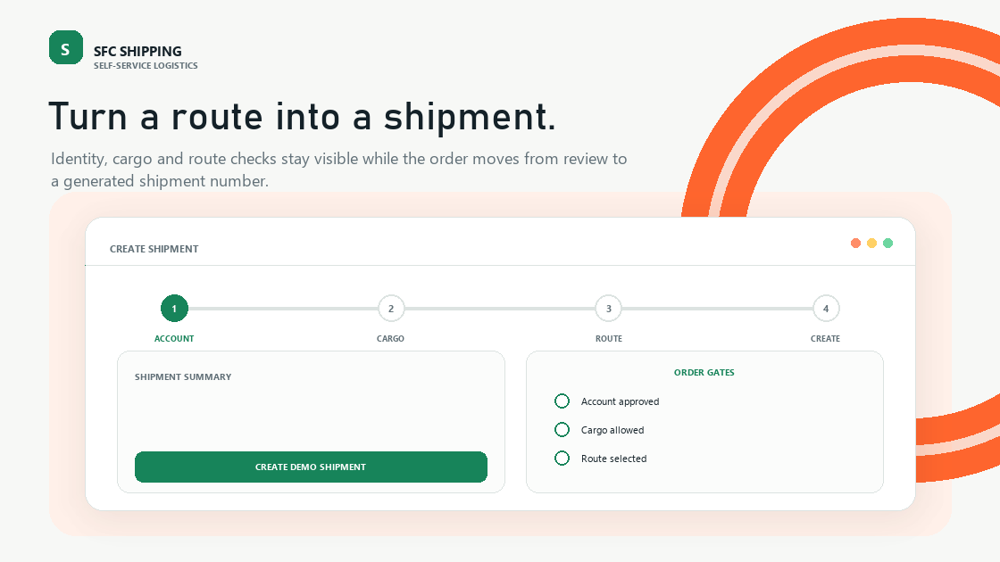
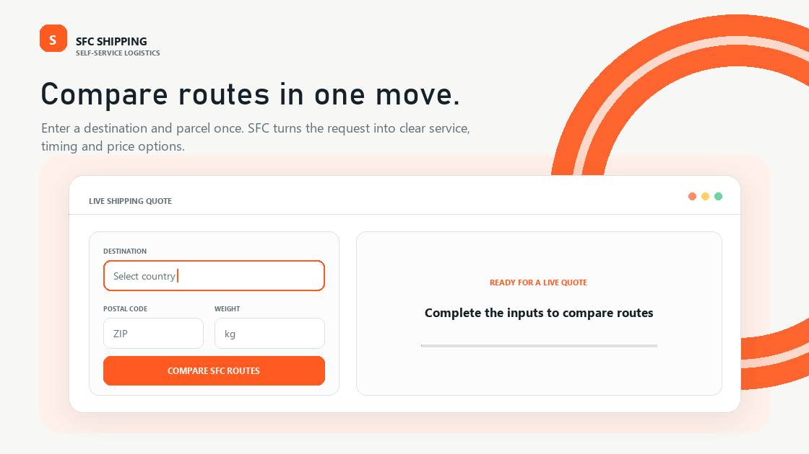
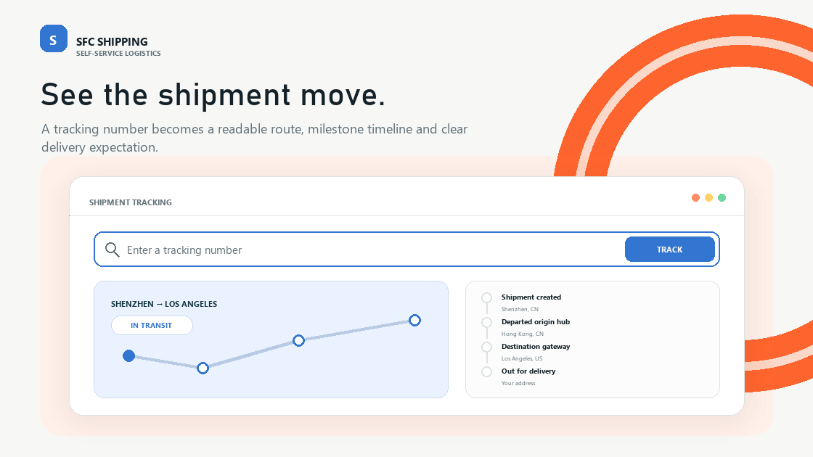
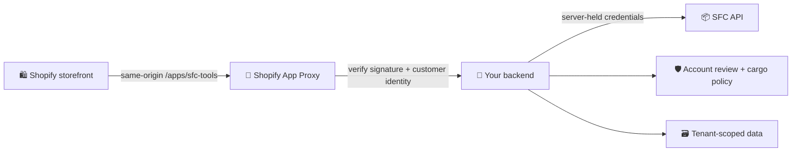
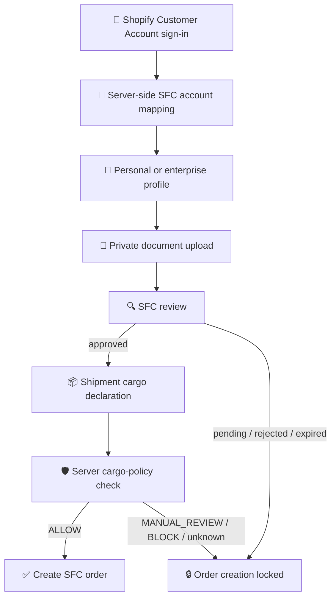

<div align="center">

# 🚚 SFC Shipping Tools

### Shopify storefront tools for shipping from China

Live rates · Account-bound tracking · Compliance review · Shipment creation · Label access

[](https://github.com/SuntekCorps-xLab/sfc-shipping-tools/actions/workflows/ci.yml)
[](https://nodejs.org/)
[](https://www.shopify.com/)
[](https://www.typescriptlang.org/)
[](https://vitest.dev/)
[](https://playwright.dev/)
[](LICENSE)

</div>

> **Terminal-style storefront infrastructure for SFC.** This repository contains the Shopify app shell and storefront client. Production credentials, private logistics adapters, pricing rules, review tooling, and the hosted SFC API remain server-side.

<table>
<tr>
<td width="50%">

### ⚡ What it does

- Compare SFC shipping rates
- Track authorized shipments
- Link Shopify customers to SFC accounts
- Manage balance and recharge entry points
- Complete personal or enterprise verification
- Declare cargo before order creation

</td>
<td width="50%">

### 🧱 What it protects

- Server-side identity resolution
- Tenant ownership for private data
- Account-review gates
- Cargo-policy decisions
- App Proxy signature validation
- Secret and credential boundaries

</td>
</tr>
</table>

## 🧭 Contents

- [✨ Capabilities](#-capabilities)
- [🏗️ Architecture](#️-architecture)
- [🔄 Customer workflow](#-customer-workflow)
- [📦 Repository layout](#-repository-layout)
- [🚀 Quick start](#-quick-start)
- [⚙️ Configuration](#️-configuration)
- [🛍️ Storefront installation](#️-storefront-installation)
- [🔌 API surface](#-api-surface)
- [🧪 Verification](#-verification)
- [🔐 Security boundary](#-security-boundary)
- [🌐 Open-source scope](#-open-source-scope)
- [🤝 Contributing](#-contributing)

## ✨ Capabilities

| Icon | Component | Responsibility | Access model |
|:---:|---|---|---|
| 💰 | **Rate engine** | Destination, parcel dimensions, first-mile mode, and route comparison | Public or account-specific, according to backend policy |
| 📍 | **Tracking** | Shipment status, carrier timeline, domestic handoff, and tracking support | Private records are scoped to the signed-in customer |
| 👤 | **Customer linking** | Shopify Customer Account sign-in and SFC account mapping | Server resolves identity; browser IDs are not trusted |
| 💳 | **Balance** | Balance display and recharge entry point | Account-bound |
| 🧾 | **Order workspace** | Order fields, cargo declarations, labels, and domestic tracking binding | Locked until required checks pass |
| 🛡️ | **Compliance** | Personal or enterprise profile, document upload, review state, and expiry handling | Fail-closed before shipment creation |
| 🧰 | **Theme extension** | Liquid block, framework-free browser modules, responsive terminal UI | Shopify Online Store 2.0 |

## 🖼️ Storefront components

The public storefront is organized around a self-service shipping journey. The README uses the corresponding visual modules below so visitors can inspect the actual product experience directly from the repository page.

### 📦 Create shipment workflow

<p align="center">
  
</p>

### 💰 Live shipping cost calculator

<p align="center">
  
</p>

### 📍 Tracking and shipment status

<p align="center">
  
</p>

> These animated product references show the intended storefront experience. Live rates, account data, tracking results, and order actions still require the server-side SFC gateway.

## 🏗️ Architecture



The browser is an untrusted client. Storefront validation improves usability, but it is not an authorization boundary.

## 🔄 Customer workflow



## 📦 Repository layout

```text
app/                              Shopify app shell and server routes
extensions/storefront-tools/
  blocks/                         Liquid storefront block
  src/                            Framework-free browser modules
  styles/                         Source styles, including terminal-theme.css
  assets/                         Generated extension assets
docs/                             Public implementation guidance
examples/                         Non-secret examples
scripts/build-storefront.mjs      Storefront CSS/JS bundler
tests/                            Vitest contract and regression tests
tests/e2e/                         Playwright browser-flow tests
.github/workflows/ci.yml          CI verification pipeline
shopify.app.example.toml          Safe app configuration template
shopify.theme.example.toml        Safe theme configuration template
```

## 🚀 Quick start

### Prerequisites

- Node.js `22.13` or newer
- npm
- Shopify CLI
- Shopify Partner / Dev Dashboard app
- Shopify development store
- Backend implementing the documented App Proxy contract
- Separately provisioned SFC API access

### Install and verify

```bash
npm ci
npm run check
```

Install the Chromium runtime once per development machine:

```bash
npx playwright install chromium
```

`npm run check` runs linting, TypeScript checks, unit tests, storefront bundling, the Shopify app build, and browser-level storefront tests.

## ⚙️ Configuration

Tracked configuration files contain placeholders only. Copy the examples locally:

```bash
cp shopify.app.example.toml shopify.app.toml
cp shopify.theme.example.toml shopify.theme.toml
```

PowerShell:

```powershell
Copy-Item shopify.app.example.toml shopify.app.toml
Copy-Item shopify.theme.example.toml shopify.theme.toml
```

Then link the local files to resources you control with Shopify CLI. Generated local configuration files are intentionally ignored by Git.

> [!CAUTION]
> Never place an SFC token, Shopify client secret, session token, customer token, or production URL in Liquid settings or browser JavaScript.

## 🛍️ Storefront installation

1. Configure an App Proxy with public prefix `/apps/sfc-tools` and a backend URL you control.
2. Deploy the app and the `storefront-tools` theme app extension.
3. In the Shopify theme editor, add **SFC shipping tools** to the desired page.
4. Keep the block API base path as `/apps/sfc-tools` unless your proxy uses another path.
5. Test with a development customer before enabling the block in a live theme.

The registration and login URLs in the block schema are editable presentation links. They are not API credentials.

## 🔌 API surface

The storefront client calls these App Proxy routes:

| Method | Route | Component | Purpose |
|:---:|---|---|---|
| `POST` | `/rates` | 💰 Rate engine | Calculate and compare shipping rates |
| `POST` | `/tracking` | 📍 Tracking | Retrieve authorized shipment tracking |
| `POST` | `/account-link` | 🔗 Customer linking | Link Shopify and SFC accounts |
| `GET` | `/balance` | 💳 Balance | Read the account balance |
| `GET` | `/orders` | 🧾 Order workspace | List account-bound orders |
| `POST` | `/order-fields` | 📝 Order workspace | Save shipment fields |
| `GET` | `/compliance` | 🛡️ Compliance | Read review and verification status |
| `POST` | `/compliance-account-class` | 🛡️ Compliance | Select personal or enterprise flow |
| `POST` | `/compliance-profile` | 🛡️ Compliance | Save verification profile |
| `POST` | `/compliance-upload` | 📎 Compliance | Upload verification documents |
| `POST` | `/compliance-submit` | 🔍 Compliance | Submit a profile for review |
| `POST` | `/cargo-compliance` | 📦 Cargo policy | Evaluate shipment cargo declarations |
| `POST` | `/create-order` | ✅ Order workspace | Create an SFC shipment |
| `POST` | `/domestic-tracking` | 🚚 Tracking | Bind China domestic tracking |
| `POST` | `/label` | 🏷️ Labels | Request a shipment label |

See [docs/API_CONTRACT.md](docs/API_CONTRACT.md) for request, response, identity, and fail-closed requirements.

## 🧪 Verification

| Check | Command | Coverage |
|---|---|---|
| 🧹 Lint | `npm run lint` | App, storefront modules, scripts, and tests |
| 🧬 Type safety | `npm run typecheck` | React Router type generation and TypeScript |
| 🧪 Unit / contract | `npm test` | Rate rendering, tracking validation, and order gates |
| 🏗️ Storefront bundle | `npm run build:storefront` | Generated `sfc-tools.js` and `sfc-tools.css` |
| 📦 App build | `npm run build` | Client and server production bundles |
| 🌐 Browser flows | `npm run test:e2e` | Rate, tracking, and compliance-gated order flows |
| ✅ Release check | `npm run check` | All checks above in sequence |

## 🔐 Security boundary

The backend must, for every protected request:

1. Verify the Shopify App Proxy signature and timestamp.
2. Resolve the Shopify customer on the server; never trust a customer ID from the browser.
3. Enforce tenant ownership for rates, tracking, orders, labels, and documents.
4. Re-check account approval and shipment cargo eligibility immediately before creating an order.
5. Keep SFC tokens and Shopify secrets in a secret manager or server environment variables.
6. Rate-limit, audit, and redact sensitive fields.

See [docs/API_CONTRACT.md](docs/API_CONTRACT.md), [docs/COMPLIANCE.md](docs/COMPLIANCE.md), [SECURITY.md](SECURITY.md), and [docs/REPOSITORY_SETTINGS.md](docs/REPOSITORY_SETTINGS.md).

## 🌐 Open-source scope

### ✅ Safe to publish

- Theme extension UI and styling
- Browser API client without credentials
- Validation helpers and tests
- Example configuration with placeholders
- Public API contract and deployment guidance

### 🔒 Keep private

- SFC and Shopify secrets
- Production hostnames and store identifiers
- Customer records, documents, shipment data, and logs
- Contract pricing rules and carrier credentials
- Review dashboards, risk rules, sanctions logic, and fraud signals
- Incident runbooks containing infrastructure details

## 🤝 Contributing

Read [CONTRIBUTING.md](CONTRIBUTING.md). Changes must pass `npm run check` and must not weaken identity, account-review, cargo-screening, or tenant-ownership controls.

## 🚨 Responsible disclosure

Do not open public issues for vulnerabilities or exposed credentials. Follow [SECURITY.md](SECURITY.md).

## 📄 License and trademarks

Code is licensed under the [Apache License 2.0](LICENSE). SFC and related brand names and marks are not granted under that license; see [TRADEMARKS.md](TRADEMARKS.md) and [NOTICE](NOTICE).

<div align="center">

**Ship from China. Keep every step in view.**

</div>
